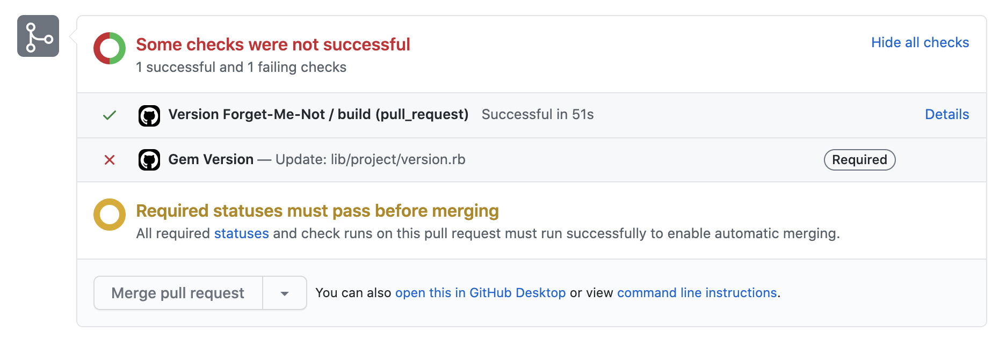
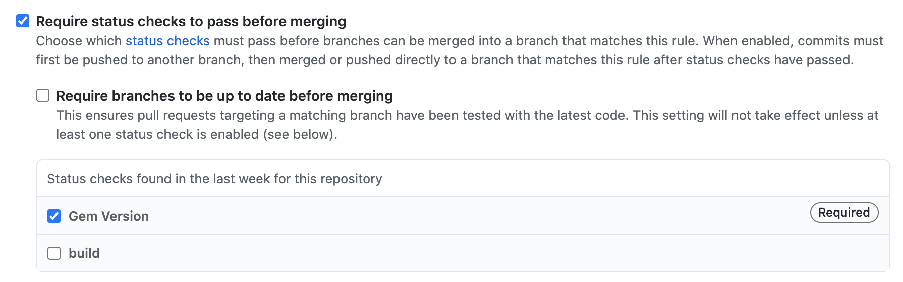

# Version Forget-Me-Not

A Github Action for Ruby projects that checks that the semantic version has been updated in a pull request.

The aim is to remind engineers to update the version before merging, since this step is often forgotten and requires a retroactive fix.

## Installation

1. Create a file called `.github/workflows/version-forget-me-not.yml` in your Gem's repository with the following YAML (modify as instructed in the comments):

   ```yaml
   name: Version Forget-Me-Not
   
   on:
     pull_request:
       branches:
         - main # Change if your default branch is different
       types: [opened, synchronize]
   jobs:
     build:
       runs-on: ubuntu-18.04
   
       steps:
         - uses: simplybusiness/version-forget-me-not@v1
           env:
             ACCESS_TOKEN: ${{ secrets.GITHUB_TOKEN }}
             # The file path where you keep the version of gem.
             # It is usually `lib/<gem name>/version.rb` or in the gemspec file.
             VERSION_FILE_PATH: "<PATH>"
   
   ```

1. Create a new Pull Request to kick off this GitHub Action. You’ll notice it show up at the bottom of your pull request.

   

1. Go to Settings → Branches → Your default branch → Mark `Gem Version` as required.

   
